# ERP System — Entity Relationship Diagram

> **Coverage:** Auth-Service (all apps: employees, authentication, audit, permissions)
> **HDMS:** private repository — models not available for automated extraction

```mermaid
erDiagram

    %% ─────────────────────────────────────────────
    %% employees app
    %% ─────────────────────────────────────────────

    Organization {
        uuid    id           PK
        string  name
        string  org_code     UK
        string  website
        string  email
        string  phone
        string  logo_url
        text    address
        bool    is_deleted
        datetime deleted_at
        datetime created_at
        datetime updated_at
    }

    Institution {
        uuid    id             PK
        string  inst_code      UK
        string  name
        string  inst_type
        text    address
        string  city
        string  contact_number
        bool    is_deleted
        datetime deleted_at
        datetime created_at
        datetime updated_at
    }

    Branch {
        uuid    id                   PK
        string  branch_id            UK
        string  branch_code          UK
        string  branch_name
        text    address
        string  city
        string  district
        string  postal_code
        string  contact_number
        string  secondary_contact
        string  email
        string  branch_head_name
        string  branch_head_contact
        string  branch_head_email
        int     established_year
        string  registration_number
        string  status
        bool    is_deleted
        datetime deleted_at
        datetime created_at
        datetime updated_at
    }

    Department {
        uuid    id          PK
        string  dept_code
        string  dept_name
        text    description
        bool    is_deleted
        datetime deleted_at
        datetime created_at
        datetime updated_at
    }

    Designation {
        uuid    id              PK
        string  position_name
        string  position_code
        text    description
        json    attribute_schema
        bool    is_deleted
        datetime deleted_at
        datetime created_at
        datetime updated_at
    }

    Employee {
        uuid    id                      PK
        string  employee_id             UK
        string  employee_code           UK
        string  full_name
        string  cnic                    UK
        string  personal_phone
        string  personal_email
        string  resume_url
        date    dob
        string  gender
        string  marital_status
        string  nationality
        string  religion
        string  employment_type
        text    residential_address
        text    permanent_address
        string  city
        string  emergency_contact_name
        string  emergency_contact_phone
        string  org_email               UK
        string  org_phone
        string  bank_name
        string  account_number
        json    education_history
        json    work_experience
        bool    is_active
        bool    is_deleted
        datetime deleted_at
        datetime created_at
        datetime updated_at
    }

    EmployeeAssignment {
        uuid    id           PK
        date    joining_date
        bool    is_primary
        bool    is_active
        string  shift
        json    role_data
        bool    is_deleted
        datetime deleted_at
        datetime created_at
        datetime updated_at
    }

    %% ─────────────────────────────────────────────
    %% authentication app
    %% ─────────────────────────────────────────────

    SuperAdmin {
        uuid    id               PK
        string  superadmin_code  UK
        string  full_name
        string  email            UK
        string  phone
        bool    is_active
        bool    is_deleted
        datetime deleted_at
        datetime created_at
        datetime updated_at
    }

    UserCredentials {
        uuid     id                      PK
        string   password_hash
        datetime last_login
        string   last_login_ip
        datetime password_changed_at
        int      failed_login_attempts
        datetime locked_until
        bool     is_deleted
        datetime deleted_at
        datetime created_at
        datetime updated_at
    }

    RefreshToken {
        uuid     id           PK
        text     token        UK
        datetime created_at
        datetime expires_at
        bool     is_revoked
        string   device_info
        string   ip_address
    }

    BlacklistedToken {
        uuid     id               PK
        string   token            UK
        datetime blacklisted_at
        datetime expires_at
        string   reason
    }

    %% ─────────────────────────────────────────────
    %% audit app
    %% ─────────────────────────────────────────────

    AuditLog {
        uuid     id          PK
        string   object_id
        string   action
        string   field_name
        text     old_value
        text     new_value
        datetime timestamp
        string   ip_address
        text     notes
    }

    %% ─────────────────────────────────────────────
    %% permissions app
    %% ─────────────────────────────────────────────

    Service {
        string code      PK
        string name
        bool   is_active
    }

    ServiceAccess {
        uuid     id          PK
        string   service
        bool     is_active
        datetime granted_at
        datetime revoked_at
        text     notes
        bool     is_deleted
        datetime deleted_at
        datetime created_at
        datetime updated_at
    }

    HdmsRole {
        uuid     id                   PK
        string   role_type
        bool     can_view_all_tickets
        bool     can_assign_tickets
        bool     can_close_tickets
        bool     can_manage_users
        datetime assigned_at
        bool     is_deleted
        datetime deleted_at
        datetime created_at
        datetime updated_at
    }

    VmsRole {
        uuid     id          PK
        string   role_type
        datetime assigned_at
        bool     is_deleted
        datetime deleted_at
        datetime created_at
        datetime updated_at
    }

    PermissionAudit {
        uuid     id            PK
        string   action
        string   service
        json     details
        datetime performed_at
        string   ip_address
    }

    %% ─────────────────────────────────────────────
    %% RELATIONSHIPS
    %% ─────────────────────────────────────────────

    %% Organization
    Organization ||--o{ Institution       : "has"
    Organization ||--o{ Department        : "global departments"
    Organization ||--o{ Employee          : "employs"
    Organization ||--o{ SuperAdmin        : "has superadmins"

    %% Institution → Branch → Department
    Institution  ||--o{ Branch            : "has"
    Institution  ||--o{ Department        : "local departments"
    Branch       ||--o{ Department        : "branch departments"
    Branch       ||--o{ EmployeeAssignment: "hosts"

    %% Department → Designation → Assignment
    Department   ||--o{ Designation       : "has"
    Department   ||--o{ EmployeeAssignment: "has"
    Designation  ||--o{ EmployeeAssignment: "has"

    %% Employee core
    Employee     ||--o{ EmployeeAssignment: "has"
    Employee     ||--|| UserCredentials   : "authenticated by"
    Employee     ||--o{ RefreshToken      : "holds"

    %% Employee → audit
    Employee     ||--o{ AuditLog          : "changed by"
    SuperAdmin   ||--o{ AuditLog          : "changed by superadmin"

    %% Employee → permissions
    Employee     ||--o{ ServiceAccess     : "has access"
    SuperAdmin   ||--o{ ServiceAccess     : "has access"
    Employee     ||--o{ ServiceAccess     : "granted by"
    Employee     ||--o{ ServiceAccess     : "revoked by"

    %% SuperAdmin auth
    SuperAdmin   ||--|| UserCredentials   : "authenticated by"
    SuperAdmin   ||--o{ RefreshToken      : "holds"

    %% Roles
    ServiceAccess ||--o| HdmsRole         : "has hdms role"
    ServiceAccess ||--o| VmsRole          : "has vms role"
    Employee      ||--o{ HdmsRole         : "assigned by"
    Employee      ||--o{ VmsRole          : "assigned by"

    %% Permission audit
    Employee      ||--o{ PermissionAudit  : "subject of"
    Employee      ||--o{ PermissionAudit  : "performed by"
```

